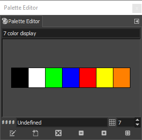
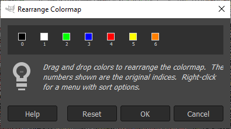
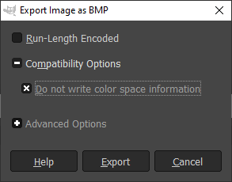

# Readme

> Original source: https://github.com/robertmoro/7ColorEPaperPhotoFrame/

Instructions that guide you through the process of creating .bmp images that can be used with the project.

## Prepare the images using Gimp
Start [GIMP](https://www.gimp.org/) and drag the image to be processed into the application.

### Create a seven color palette
Use the palette editor to create a seven color palette
|  |Color		|Bin		|Hex|R,G,B				|
|---|-------|-------|-----|-----------|
|1. |Black 	|0b000	|0x0	|0,0,0			|
|2. |White	|0b001	|0x1	|255,255,255|
|3. |Green	|0b010	|0x2	|0,255,0		|
|4. |Blue		|0b011	|0x3	|0,0,255		|
|5. |Red		|0b100	|0x4	|255,0,0		|
|6. |Yellow	|0b101	|0x5	|255,255,0	|
|7. |Orange	|0b110	|0x6	|255,128,0	|

 
*GIMP Palatte Editor dialog*
  
### Rearrange the colormap
Make sure that the colors are arranged in the correct order in the Rearrange Colormap dialog. 
Main menu or right click image and select
- Colors >
- Map >
- Rearrange Colormap...
- Make sure the colors are ordered as mentioned above in the color palette or the image below, and select OK

 
*Rearrange Colormap dialog*

### Resize and crop
Resize to 600 width or 448 height so an 600 by 448 image can be cropped.

#### Resize
Main menu / right click image and select
- Image >
- Scale Image...
- Provide width and or height
- Select Scale to apply the selection

#### Crop
'Shift + C' or main menu / right click image and select 
- Tools >
- Transform Tools >
- Crop (Shift + C)
- Use mouse and or size and position fields
- Select Enter to apply the crop or Esc to leave the Crop menu

### Dither
Main menu / right click image and select
- Image >
- Mode >
- Indexed...
- Use custom pallete
- Select the created 7 color palette
- Select Floyd-Steinberg for Color dithering
- Select Convert

### Export as BMP
'Shift + Ctrl + E' or main menu / right click image and select
- File
- Export as (Shift + Ctrl + E)
- Type a filename and give it the bmp extension
- Deselect 'run-length encoding'
- Under 'Compatibility options' select 'Do not write color space information'
- Select Export

 
*GIMP Export Image as BMP dialog*